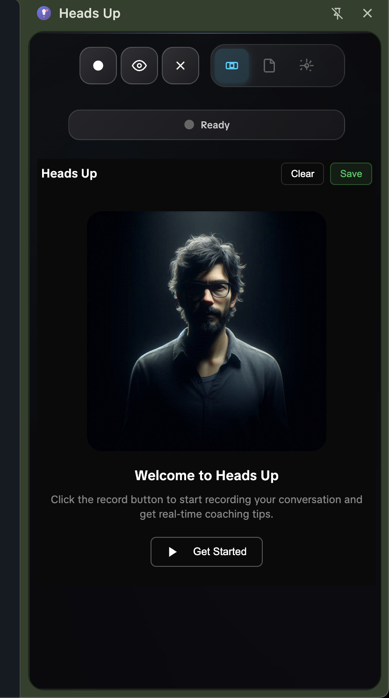

# Heads Up - AI Sales Coach Chrome Extension



Coach your team via Chrome. Real-time transcription and AI insights.

## ✨ Features

- 🎙️ **Real-time Speech Transcription** - Captures and transcribes your sales conversations as they happen
- 🤖 **AI-Powered Analysis** - Get instant coaching insights using OpenAI, Claude, or local LLMs
- 📊 **Session Analytics** - Track conversation metrics like word count and duration
- 💾 **Data Persistence** - Your transcripts are saved even if you switch tabs
- 📋 **Export Options** - Save or copy transcripts and AI analysis
- 🎯 **Customizable Coaching** - Create your own content mappings for specific keywords
- 🔒 **Privacy-First** - All data stays local, API keys are encrypted

## 🚀 Installation

### From Source

1. Clone this repository:
   ```bash
   git clone https://github.com/justynroberts/headsup.git
   cd headsup
   ```

2. Open Chrome and navigate to `chrome://extensions/`

3. Enable "Developer mode" in the top right corner

4. Click "Load unpacked" and select the `extension` folder from this repository

5. The Heads Up extension icon will appear in your Chrome toolbar

### Permissions Required

The extension requires the following permissions:
- **Microphone Access** - For speech recognition
- **Storage** - To save your settings and transcripts locally
- **Notifications** - To notify you when recording continues in background

## 🎯 Quick Start

1. Click the Heads Up icon in your Chrome toolbar
2. Click "Get Started" or the record button
3. Allow microphone access when prompted
4. Start your sales call - Heads Up will transcribe in real-time
5. Click the analyze button after your call for AI insights

## 📖 User Guide

For detailed instructions on using all features, please see our [User Guide](USERGUIDE.md).

## 🔧 Configuration

### LLM Setup

Heads Up supports multiple LLM providers:

1. **OpenAI (ChatGPT)**
   - Get your API key from [OpenAI Platform](https://platform.openai.com)
   - Default model: `gpt-3.5-turbo`

2. **Claude (Anthropic)**
   - Get your API key from [Anthropic Console](https://console.anthropic.com)
   - Default model: `claude-3-haiku-20240307`

3. **Ollama (Local)**
   - Install [Ollama](https://ollama.ai) on your machine
   - Default URL: `http://localhost:11434`

### Quick Start with Sample Configuration

We've included a `sample-config.json` file that contains:
- Pre-configured LLM settings
- 5 ready-to-use content mappings for common sales scenarios
- Example prompts for AI analysis

To use it:
1. Open Heads Up and go to Settings
2. Click "Import Data"
3. Select the `sample-config.json` file
4. Add your API key in the LLM settings
5. You're ready to go!

This gives you a head start with proven coaching responses for pricing objections, competitor mentions, and more.

## 🛠️ Development

### Project Structure

```
headsup/
├── extension/          # Chrome extension source code
│   ├── manifest.json   # Extension manifest
│   ├── background.js   # Background service worker
│   ├── sidepanel.js    # Main application logic
│   ├── sidepanel.html  # Side panel UI
│   ├── styles.css      # Application styles
│   └── assets/         # Icons and images
├── images/            # README images
└── USERGUIDE.md       # Detailed user guide
```

### Building from Source

The extension is built with vanilla JavaScript and requires no build process. Simply load the `extension` folder as an unpacked extension in Chrome.

### Contributing

1. Fork the repository
2. Create your feature branch (`git checkout -b feature/amazing-feature`)
3. Commit your changes (`git commit -m 'Add some amazing feature'`)
4. Push to the branch (`git push origin feature/amazing-feature`)
5. Open a Pull Request

## 🔐 Privacy & Security

- All transcription happens locally in your browser
- API keys are stored securely in Chrome's local storage
- No data is sent to any servers except for LLM analysis (when configured)
- Transcripts and settings remain on your device

## 📝 License

This project is licensed under the MIT License - see the [LICENSE](LICENSE) file for details.

## 🙏 Acknowledgments

- Built with the Web Speech API for real-time transcription
- Uses Chrome's Side Panel API for seamless integration
- Inspired by the need for better sales coaching tools

## 📧 Support

For issues, feature requests, or questions:
- Open an issue on [GitHub](https://github.com/justynroberts/headsup/issues)
- Check our [User Guide](USERGUIDE.md) for detailed documentation

---

Made with ❤️ by [Justyn Roberts](https://github.com/justynroberts)