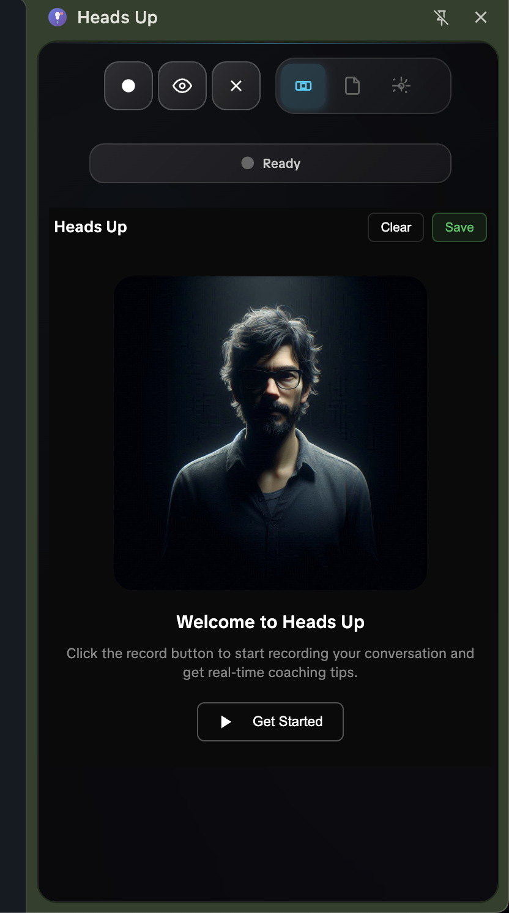

# Heads Up User Guide



It's a coach in your Chrome browser.

## Table of Contents

1. [Getting Started](#getting-started)
2. [Recording Conversations](#recording-conversations)
3. [Live Transcription](#live-transcription)
4. [AI Analysis](#ai-analysis)
5. [Content Mappings](#content-mappings)
6. [Data Management](#data-management)
7. [Keyboard Shortcuts](#keyboard-shortcuts)
8. [Troubleshooting](#troubleshooting)

## Getting Started

### First Time Setup

1. **Open Heads Up**
   - Click the Heads Up icon in your Chrome toolbar
   - The side panel will open on the right side of your browser

2. **Configure LLM (Optional but Recommended)**
   - Navigate to the Settings tab (gear icon)
   - Click "LLM Configuration" to expand settings
   - Choose your preferred provider:
     - OpenAI (ChatGPT)
     - Claude (Anthropic)
     - Ollama (Local)
   - Enter your API key
   - Save your settings

3. **Grant Microphone Access**
   - Click "Get Started" or the record button
   - Chrome will ask for microphone permission
   - Click "Allow" to enable speech recognition

## Recording Conversations

### Starting a Recording

1. **Click the Record Button**
   - The large circular button in the top controls
   - Button turns red when recording
   - Status changes to "Recording..."

2. **Alternative Methods**
   - Click "Get Started" button on first use
   - Use keyboard shortcut (if configured)

### During Recording

- **Live Transcription**: Words appear in real-time as you speak
- **Session Timer**: Shows elapsed recording time
- **Word Count**: Tracks total words transcribed
- **Auto-Recovery**: Recording continues even if recognition restarts

### Stopping a Recording

1. **Click the Record Button Again**
   - Button returns to normal state
   - Recording stops immediately
   - Session analytics appear

2. **What Happens Next**
   - Transcript is saved automatically
   - Analyze button appears (if LLM configured)
   - Copy/Save options become available

## Live Transcription

### Understanding the Display

- **Interim Results**: Gray text that appears as you speak
- **Final Results**: Black text that's been confirmed
- **Auto-Scroll**: View automatically scrolls to show latest text

### Live View Toggle

- Click the eye icon to show/hide live transcription
- Useful for minimizing distractions during calls
- Transcription continues even when hidden

## AI Analysis

### Running Analysis

1. **After Recording Stops**
   - Click "🤖 Analyze with LLM" button
   - Analysis begins immediately
   - Status shows "Analyzing transcript..."

2. **Analysis Results**
   - AI insights appear in the coaching section
   - Results are formatted for easy reading
   - Copy/Save options appear automatically

### Customizing Analysis Prompts

1. Go to Settings → LLM Configuration
2. Edit the "Analysis Prompt" field
3. Use `{transcript}` as placeholder for conversation text
4. Save your settings

### Example Prompts

```
Analyze this sales conversation and provide:
1. Key objections raised
2. Opportunities missed
3. Suggested follow-up actions

Transcript: {transcript}
```

## Content Mappings

### What are Content Mappings?

Content mappings are pre-configured coaching responses triggered by specific keywords during your conversation.

### Creating Mappings

1. **Navigate to Content Management Tab**
   - Click the document icon in navigation

2. **Configure Your Mapping**
   - **Type**: Choose category (Objection, Closing, Competitive, etc.)
   - **Keywords**: Enter comma-separated trigger words
   - **Response**: Write your coaching response

3. **Save the Mapping**
   - Click "Add Content Mapping"
   - Mapping is saved immediately

### Example Mappings

**Objection Handler**
- Keywords: `price, cost, expensive, budget`
- Response: `Focus on value and ROI. Ask about the cost of not solving the problem.`

**Competitive Intel**
- Keywords: `competitor, alternative, other option`
- Response: `Highlight our unique differentiators: 24/7 support, no setup fees, industry-leading SLA.`

## Data Management

### Saving Data

**During/After Recording:**
- **Copy Transcript**: Copies transcript to clipboard
- **Save Transcript**: Downloads as .txt file
- **Copy Analysis**: Copies AI analysis to clipboard
- **Save Analysis**: Downloads analysis as .txt file
- **Save All**: Downloads complete session report

### Import/Export

1. **Export All Data**
   - Settings → Data Management → Export All Data
   - Downloads JSON file with all settings and mappings

2. **Import Data**
   - Settings → Data Management → Import Data
   - Select previously exported JSON file
   - All settings and mappings are restored

3. **Using the Sample Configuration**
   - We provide a `sample-config.json` with pre-built coaching responses
   - Contains 5 common sales scenarios:
     - Pricing objections
     - Competitor mentions
     - Decision timeline questions
     - Technical concerns
     - Authority checks
   - To import: Settings → Import Data → Select `sample-config.json`
   - Remember to add your API key after importing

### Clear Data

- Settings → Data Management → Clear All Data
- ⚠️ This permanently deletes all local data

## Keyboard Shortcuts

Configure keyboard shortcuts in Chrome:

1. Navigate to `chrome://extensions/shortcuts`
2. Find "Heads Up"
3. Set your preferred shortcuts for:
   - Toggle Recording
   - Toggle Live View

## Troubleshooting

### Microphone Not Working

1. **Check Permission**
   - Look for microphone icon in address bar
   - Ensure it's set to "Allow"

2. **Test Microphone**
   - Open side panel
   - Try recording again
   - Check Chrome's site settings

### Transcription Issues

1. **Words Not Appearing**
   - Check internet connection (required for speech recognition)
   - Ensure microphone is not muted
   - Try refreshing the side panel

2. **Transcription Gaps**
   - Normal during processing
   - All words are preserved in final transcript

### LLM Analysis Errors

1. **API Key Issues**
   - Verify API key is correct
   - Check key has sufficient credits
   - Ensure key has proper permissions

2. **Connection Errors**
   - Check internet connection
   - For Ollama, ensure it's running locally
   - Try a different LLM provider

### Data Persistence

- **Transcript Disappears**: Click on Recording tab to restore
- **Settings Not Saving**: Check Chrome storage permissions
- **Extension Crashes**: Report issue on GitHub

## Configuration File Format

If you want to create your own configuration file or modify the sample, here's the structure:

```json
{
  "llmSettings": {
    "provider": "openai",
    "apiKey": "YOUR_API_KEY",
    "model": "gpt-3.5-turbo",
    "prompt": "Your analysis prompt with {transcript} placeholder",
    "autoAnalyze": "ask"
  },
  "contentMappings": [
    {
      "id": "unique-id",
      "type": "objection|closing|competitive|hint|keyword",
      "keywords": ["trigger", "words"],
      "response": "Your coaching response"
    }
  ]
}
```

## Tips for Best Results

1. **Speak Clearly**: Better audio = better transcription
2. **Minimize Background Noise**: Use in quiet environment
3. **Regular Saves**: Export important sessions immediately
4. **Test First**: Do a quick test recording before important calls
5. **Keep Chrome Updated**: Ensures compatibility
6. **Import Sample Config**: Get started quickly with proven coaching responses

## Privacy Notes

- Transcription uses Google's speech recognition service
- Audio is processed in real-time and not stored
- LLM analysis only sends transcript text, not audio
- All data remains local unless you export it

---

Need more help? [Open an issue](https://github.com/justynroberts/headsup/issues) on GitHub.